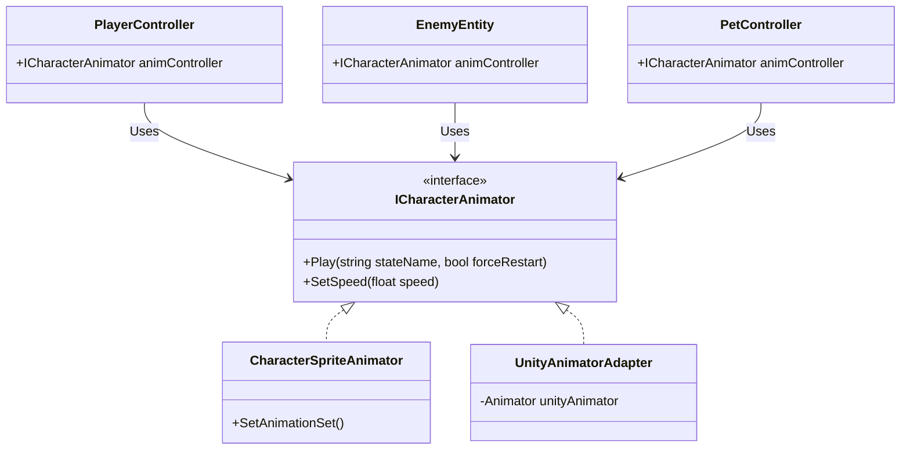

# Mado Project 통합 애니메이션 아키텍처 리팩토링 제안서

본 문서는 할로우 나이트(Hollow Knight)나 실크송(Silksong)과 같은 대규모 2D 메트로배니아 게임 개발을 목표로, 향후 수백 종의 적(Enemy), NPC, 펫(Pet), 그리고 다중 폼을 가진 플레이어(Player)가 효율적이고 유연하게 애니메이션을 공유하고 확장할 수 있도록 애니메이션 아키텍처를 전면 리팩토링하는 계획서입니다.

## 1. 현재 구조의 문제점 (Problem Statement)

현재 프로젝트의 애니메이션 제어 구조는 개체별로 파편화되어 있으며, 시스템 간 결합도가 높아 확장에 불리합니다.

1. **파편화된 애니메이션 시스템**
   * **Player**: 커스텀 스프라이트 시스템 (`CharacterSpriteAnimator`) 사용
   * **Enemy**: 유니티 빌트인 시스템 (`Animator`) 사용
   * **Pet**: 애니메이션 미구현 (Floating 물리 이동만 존재)
2. **높은 결합도와 하드코딩**
   * 적(Enemy)의 모듈(`WalkModule`, `MeleeSwingModule` 등) 내부에서 `entity.Animator.Play("Walk")` 형태로 Unity Animator에 직접 의존(Hard Dependency)하고 있습니다.
   * NPC나 몬스터, 보스를 새로 추가할 때마다 스크립트 내부의 애니메이션 호출 코드를 개별적으로 수정/관리해야 합니다.
3. **생산성 저하**
   * 애니메이션 시스템이 교체(예: Spine, 커스텀 스프라이트, Unity Animator 혼용)될 경우, 모든 AI 모듈 코드를 뜯어고쳐야 하는 리스크가 존재합니다.

---

## 2. 제안하는 아키텍처 (Proposed Architecture)

모든 생명체(Entity)의 애니메이션 제어를 추상화하여, **비즈니스 로직(AI/FSM)과 애니메이션 렌더링 시스템을 완전히 분리(Decoupling)** 합니다. 

### 핵심 설계: Facade & Strategy 패턴 도입

### 상세 구현 전략

#### A. 애니메이터 인터페이스 (`ICharacterAnimator`) 도출
애니메이션 재생 방식(Unity 기본 vs 커스텀 스프라이트)과 무관하게, 로직 코드에서 접근할 수 있는 단일 창구를 만듭니다.
* **기대 효과**: AI 스크립트나 모듈에서 특정 애니메이션 기술에 얽매이지 않고 `animController.Play("Idle")`로 일관성 있게 호출.

#### B. 유니티 어댑터 (`UnityAnimatorAdapter`) 생성
기존 Enemy에 사용되던 유니티 빌트인 `Animator`를 `ICharacterAnimator` 규격에 맞게 감싸는 래퍼(Wrapper) 컴포넌트입니다.
* **기대 효과**: 기존 Enemy 모듈 코드를 거의 건드리지 않고 인터페이스 연동 완료 가능.

#### C. FSM(상태 머신) 기반 자동 매핑 (Auto-Mapping)
이미 `PlayerState`에 구현되어 있는 **리플렉션(Reflection) 기반 상태 이름 추출 로직**을 Pet과 Enemy의 FSM/Module 베이스 구조에도 확장 적용합니다.
* **기능**: 상태 클래스 이름(예: `PetFollowState`)에서 접두어/접미어를 제거해 `"Follow"`라는 애니메이션 키값을 자동 도출.
* **기대 효과**: 향후 100종의 적 상태 코드를 작성하더라도, 애니메이션 재생 코드를 단 한 줄도 명시적으로 적을 필요 없이 자동으로 연동됨. (Super Scalable)

---

## 3. 리팩토링 진행 마일스톤 (Milestones)

리팩토링은 기존 시스템의 파손을 막기 위해 3단계로 점진적 적용합니다.

* **Phase 1: 기반 시스템 구축 (Foundation)**
  * [NEW] `ICharacterAnimator` 인터페이스 작성
  * [NEW] `UnityAnimatorAdapter` 컴포넌트 작성
  * [MODIFY] `CharacterSpriteAnimator`가 `ICharacterAnimator`를 상속하도록 구조 변경
* **Phase 2: 핵심 개체 연동 (Integration)**
  * [MODIFY] `EnemyEntity` 및 모든 Enemy 하위 Module들의 `Animator` 참조를 `ICharacterAnimator`로 교체
  * [MODIFY] `PlayerController` 내부 구조 정리
  * [MODIFY] `PetController` 및 `PetState`에 인터페이스 적용 및 자동 매핑(Auto-Mapping) 기능 도입
* **Phase 3: 테스트 및 안정화 (Validation)**
  * 플레이어 변신(Form) 정상 작동 확인
  * 기존 에너미 전투(MeleeSwing, Walk, Dash 등) 정상 전환 확인
  * 펫 애니메이션 세트 연동 테스트

---

## 4. 파급 효과 및 요약 (Impact)

> [!TIP]
> **확장성 극대화 (Super Scalable)**
> 이 구조가 정착되면, 기획자나 테크니컬 아티스트(TA)는 **프로그래머의 도움 없이** 에디터에서 컴포넌트 조립(Unity Animator를 쓸지, 커스텀 Animator를 쓸지)만으로 완전히 새로운 NPC나 보스를 창조할 수 있습니다. 

> [!IMPORTANT]
> **유지 보수성 (Maintainability)**
> 나중에 Spine 2D 애니메이션이나 다른 에셋 플러그인을 게임에 추가하더라도, `SpineAnimatorAdapter` 클래스 하나만 추가하면 기존 수십 개의 AI 로직 코드는 **0줄**의 수정만으로 호환됩니다. 전문가 수준의 견고한 객체 지향 원칙(SOLID - OCP)이 적용된 설계입니다.

---

## 5. User Review Required (피드백 요청)

이 아키텍처 제안은 게임의 근간을 바꾸는 매우 중요한 작업이므로, 임원진 및 타 AI의 리뷰를 거치기에 적합하게 작성되었습니다. 

진행 여부 결정을 위해 다음 항목에 대한 승인을 부탁드립니다:
1. **방향성 동의**: 인터페이스 추상화(`ICharacterAnimator`) 및 모듈 수정 진행 여부
2. **범위 동의**: 적(Enemy), 펫(Pet), 플레이어(Player) 전반에 걸친 통합 리팩토링 진행 여부

승인해 주시면(`오케이` 등), 위 마일스톤의 Phase 1 부터 코딩 및 시스템 적용을 시작하도록 하겠습니다.
